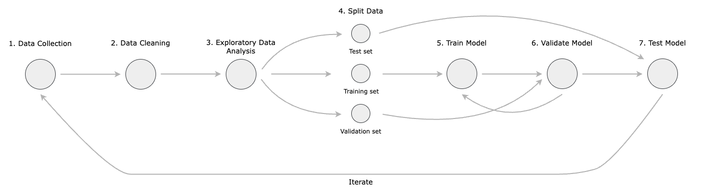

# Ireland Housing Dataset Analysis

In this repository you can find details about a data analysis and machine learning project aimed at investigating
whether or not social economical variables have any influence on the price of houses in Ireland.

The dataset used in this analysis was obtained by webscrapping the Daft.ie website using the well-known python package [daftlistings](https://pypi.org/project/daftlistings/1.1.6/).

The steps followed in this project to do the analysis can be better visualised in the image below.

For the Data Collection step, you can find further information at:

* [Collect Data](/scripts/collection/)
  * In this folder, the python scripts used for collecting the data are stored, you can follow the instructions defined in the README file to run it.
  
  * One important caveat is the fact that the dataset of house listings is time dependent, which means that houses listed today may not be available anymore tomorrow or in a few months time.

  * In order to address the above, the dataset collected is stored and kept prestine inside the [datasets folder](/datasets/house_listings_all.csv)

* [Data Preparation](/scripts/cleaning/)

    * In this folder, you can find all the steps taken to clean the dataset, such as:
  
      1. Removing duplicate observations
      2. Handling of missing values
      3. Removal of unnecessary variables
      4. Renaming variables
      5. Conversion into appropriate data types
      6. Creation of new variables
      7. Handling Outliers
      8. Writing the clean dataset

* [Exploratory Data Analysis](/scripts/exploration/)

    * In this step, the goal is to perform the following tasks:

        1. Data Visualisation: 
           
           * Histograms of variables
           * Box Plot
           * Density charts
           * Heat Maps
           * Spatial plots
  
        2. Summary Statistics:
           
           * Mean 
           * Median 
           * Mode
           * Standard Deviation 
           * Correlation coefficients.

        3. Data Distribution
        4. Outliers
        5. Feature Engineering
        6. Hypoteshis testing
        7. Data Normalisation
        8. Further data cleaning

* [Model Selection](/scripts/model-selection/)

   1. Evaluation metrics selection
   2. Choosing candidate models
   3. Training and evaluation models
   4. Model testing
   5. Model validation