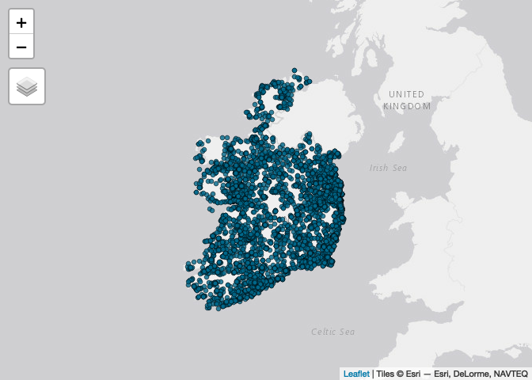
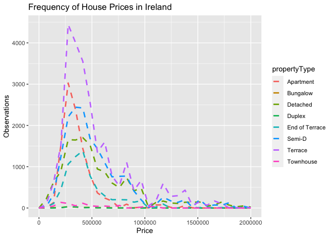
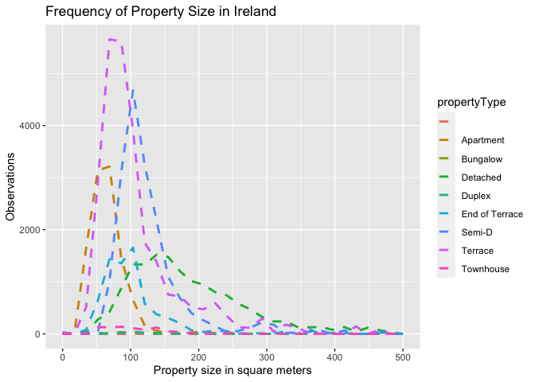

Ireland Housing - Exploratory Data Analysis - EDA
================
Marcos Cavalcante
2023-04-14

- <a href="#exploratory-data-analysis"
  id="toc-exploratory-data-analysis">Exploratory Data Analysis</a>
- <a href="#installing-libraries" id="toc-installing-libraries">Installing
  libraries</a>
- <a href="#summary-statistics" id="toc-summary-statistics">Summary
  Statistics</a>
- <a href="#data-distribution-and-relationship"
  id="toc-data-distribution-and-relationship">Data Distribution and
  Relationship</a>
  - <a href="#data-exploration---price-target-variable"
    id="toc-data-exploration---price-target-variable">Data Exploration -
    Price target variable</a>
  - <a href="#data-exploration---correlation-matrix"
    id="toc-data-exploration---correlation-matrix">Data Exploration -
    Correlation Matrix</a>
  - <a
    href="#data-exploration---analysing-relationship-between-price-and-size"
    id="toc-data-exploration---analysing-relationship-between-price-and-size">Data
    Exploration - Analysing relationship between price and size</a>
  - <a
    href="#data-exploration---analysing-relationship-between-price-and-number-of-bathrooms"
    id="toc-data-exploration---analysing-relationship-between-price-and-number-of-bathrooms">Data
    Exploration - Analysing relationship between price and number of
    bathrooms</a>
  - <a
    href="#data-exploration---analysing-relationship-between-price-and-number-of-bedrooms"
    id="toc-data-exploration---analysing-relationship-between-price-and-number-of-bedrooms">Data
    Exploration - Analysing relationship between price and number of
    bedrooms</a>
- <a href="#visualisation-of-character-variables"
  id="toc-visualisation-of-character-variables">Visualisation of character
  variables</a>
  - <a href="#property-type-by-price-bivariate-graph"
    id="toc-property-type-by-price-bivariate-graph">Property Type by Price
    Bivariate graph</a>
  - <a href="#house-price" id="toc-house-price">House Price</a>
  - <a href="#plotting-the-data-spatially"
    id="toc-plotting-the-data-spatially">Plotting the data spatially</a>
- <a href="#loading-shapefile-with-the-map-of-ireland"
  id="toc-loading-shapefile-with-the-map-of-ireland">Loading shapefile
  with the map of Ireland</a>
- <a href="#joining-the-two-objects-together"
  id="toc-joining-the-two-objects-together">Joining the two objects
  together</a>

## Exploratory Data Analysis

In this part of the study, the following tasks will be performed:

- **Creation of Summary Statistics**
- **Data Distribution**
- **Data Visualisation**
- **Outliers**
- **Feature Engineering**
- **Hypothesis Testing**
- **Data Cleaning**

## Installing libraries

First step is to install and load the necessary libraries.

``` r
packages <- c("tidyverse", "haven", "devtools", "dplyr", 
              "ggplot2", "gapminder", "patchwork", "ggridges", 
              "corrplot", "gridExtra", "sf","tmap","rgdal","rgeos",
              "adehabitatHR", "knitr", "kableExtra")

if(sum(as.numeric(!packages %in% installed.packages())) != 0){
  installer <- packages[!packages %in% installed.packages()]
  for(i in 1:length(installer)) {
    install.packages(installer, dependencies = T)
    break()
  }
  sapply(packages, require, character = T) 
} else {
  sapply(packages, require, character = T) 
}

devtools::install_github("ropensci/skimr")
webshot::install_phantomjs()

library(skimr)
```

## Summary Statistics

In this stage, the dataset will be looked at from many perspectives, the
target variable, **price**, will be looked at carefully when comparing
it with the other variables in the dataset.

The other variables in the dataset will also be analysed and some
feature engineering techniques may be used to derive other pieces of
data from them.

As an input in this step, the **ireland_houses_cleaned.csv** file will
be used as it was created in the previous notebook where the dataset was
cleaned.

Let’s start by using the skim library to have a glimpse of the dataset.

``` r
dataset_directory <- "../../datasets/"
dataset_filename <- paste(dataset_directory, "ireland_houses_cleaned.csv", sep="")

ireland_houses <- read.csv(file = dataset_filename ) # Load the dataset

options(scipen = 999) # turn off scientific notation

skim(ireland_houses)
```

<table style="width: auto;" class="table table-condensed">
<caption>
Data summary
</caption>
<tbody>
<tr>
<td style="text-align:left;">
Name
</td>
<td style="text-align:left;">
ireland_houses
</td>
</tr>
<tr>
<td style="text-align:left;">
Number of rows
</td>
<td style="text-align:left;">
9009
</td>
</tr>
<tr>
<td style="text-align:left;">
Number of columns
</td>
<td style="text-align:left;">
12
</td>
</tr>
<tr>
<td style="text-align:left;">
\_\_\_\_\_\_\_\_\_\_\_\_\_\_\_\_\_\_\_\_\_\_\_
</td>
<td style="text-align:left;">
</td>
</tr>
<tr>
<td style="text-align:left;">
Column type frequency:
</td>
<td style="text-align:left;">
</td>
</tr>
<tr>
<td style="text-align:left;">
character
</td>
<td style="text-align:left;">
6
</td>
</tr>
<tr>
<td style="text-align:left;">
numeric
</td>
<td style="text-align:left;">
6
</td>
</tr>
<tr>
<td style="text-align:left;">
\_\_\_\_\_\_\_\_\_\_\_\_\_\_\_\_\_\_\_\_\_\_\_\_
</td>
<td style="text-align:left;">
</td>
</tr>
<tr>
<td style="text-align:left;">
Group variables
</td>
<td style="text-align:left;">
None
</td>
</tr>
</tbody>
</table>

**Variable type: character**

<table>
<thead>
<tr>
<th style="text-align:left;">
skim_variable
</th>
<th style="text-align:right;">
n_missing
</th>
<th style="text-align:right;">
complete_rate
</th>
<th style="text-align:right;">
min
</th>
<th style="text-align:right;">
max
</th>
<th style="text-align:right;">
empty
</th>
<th style="text-align:right;">
n_unique
</th>
<th style="text-align:right;">
whitespace
</th>
</tr>
</thead>
<tbody>
<tr>
<td style="text-align:left;">
address
</td>
<td style="text-align:right;">
0
</td>
<td style="text-align:right;">
1
</td>
<td style="text-align:right;">
18
</td>
<td style="text-align:right;">
102
</td>
<td style="text-align:right;">
0
</td>
<td style="text-align:right;">
8871
</td>
<td style="text-align:right;">
0
</td>
</tr>
<tr>
<td style="text-align:left;">
propertyType
</td>
<td style="text-align:right;">
0
</td>
<td style="text-align:right;">
1
</td>
<td style="text-align:right;">
6
</td>
<td style="text-align:right;">
14
</td>
<td style="text-align:right;">
0
</td>
<td style="text-align:right;">
8
</td>
<td style="text-align:right;">
0
</td>
</tr>
<tr>
<td style="text-align:left;">
berRating
</td>
<td style="text-align:right;">
0
</td>
<td style="text-align:right;">
1
</td>
<td style="text-align:right;">
0
</td>
<td style="text-align:right;">
6
</td>
<td style="text-align:right;">
178
</td>
<td style="text-align:right;">
17
</td>
<td style="text-align:right;">
0
</td>
</tr>
<tr>
<td style="text-align:left;">
location
</td>
<td style="text-align:right;">
0
</td>
<td style="text-align:right;">
1
</td>
<td style="text-align:right;">
4
</td>
<td style="text-align:right;">
61
</td>
<td style="text-align:right;">
0
</td>
<td style="text-align:right;">
118
</td>
<td style="text-align:right;">
0
</td>
</tr>
<tr>
<td style="text-align:left;">
county
</td>
<td style="text-align:right;">
0
</td>
<td style="text-align:right;">
1
</td>
<td style="text-align:right;">
4
</td>
<td style="text-align:right;">
9
</td>
<td style="text-align:right;">
0
</td>
<td style="text-align:right;">
26
</td>
<td style="text-align:right;">
0
</td>
</tr>
<tr>
<td style="text-align:left;">
townOrNeighbourhood
</td>
<td style="text-align:right;">
0
</td>
<td style="text-align:right;">
1
</td>
<td style="text-align:right;">
4
</td>
<td style="text-align:right;">
52
</td>
<td style="text-align:right;">
0
</td>
<td style="text-align:right;">
114
</td>
<td style="text-align:right;">
0
</td>
</tr>
</tbody>
</table>

**Variable type: numeric**

<table>
<thead>
<tr>
<th style="text-align:left;">
skim_variable
</th>
<th style="text-align:right;">
n_missing
</th>
<th style="text-align:right;">
complete_rate
</th>
<th style="text-align:right;">
mean
</th>
<th style="text-align:right;">
sd
</th>
<th style="text-align:right;">
p0
</th>
<th style="text-align:right;">
p25
</th>
<th style="text-align:right;">
p50
</th>
<th style="text-align:right;">
p75
</th>
<th style="text-align:right;">
p100
</th>
<th style="text-align:left;">
hist
</th>
</tr>
</thead>
<tbody>
<tr>
<td style="text-align:left;">
price
</td>
<td style="text-align:right;">
0
</td>
<td style="text-align:right;">
1
</td>
<td style="text-align:right;">
462485.76
</td>
<td style="text-align:right;">
556102.05
</td>
<td style="text-align:right;">
40000.00
</td>
<td style="text-align:right;">
245000.00
</td>
<td style="text-align:right;">
340000.00
</td>
<td style="text-align:right;">
495000.00
</td>
<td style="text-align:right;">
15000000.00
</td>
<td style="text-align:left;">
▇▁▁▁▁
</td>
</tr>
<tr>
<td style="text-align:left;">
size
</td>
<td style="text-align:right;">
0
</td>
<td style="text-align:right;">
1
</td>
<td style="text-align:right;">
145.76
</td>
<td style="text-align:right;">
150.64
</td>
<td style="text-align:right;">
20.00
</td>
<td style="text-align:right;">
86.00
</td>
<td style="text-align:right;">
112.00
</td>
<td style="text-align:right;">
164.00
</td>
<td style="text-align:right;">
6109.00
</td>
<td style="text-align:left;">
▇▁▁▁▁
</td>
</tr>
<tr>
<td style="text-align:left;">
bedrooms
</td>
<td style="text-align:right;">
0
</td>
<td style="text-align:right;">
1
</td>
<td style="text-align:right;">
3.43
</td>
<td style="text-align:right;">
1.35
</td>
<td style="text-align:right;">
1.00
</td>
<td style="text-align:right;">
3.00
</td>
<td style="text-align:right;">
3.00
</td>
<td style="text-align:right;">
4.00
</td>
<td style="text-align:right;">
30.00
</td>
<td style="text-align:left;">
▇▁▁▁▁
</td>
</tr>
<tr>
<td style="text-align:left;">
bathrooms
</td>
<td style="text-align:right;">
0
</td>
<td style="text-align:right;">
1
</td>
<td style="text-align:right;">
2.35
</td>
<td style="text-align:right;">
1.35
</td>
<td style="text-align:right;">
1.00
</td>
<td style="text-align:right;">
1.00
</td>
<td style="text-align:right;">
2.00
</td>
<td style="text-align:right;">
3.00
</td>
<td style="text-align:right;">
28.00
</td>
<td style="text-align:left;">
▇▁▁▁▁
</td>
</tr>
<tr>
<td style="text-align:left;">
latitude
</td>
<td style="text-align:right;">
0
</td>
<td style="text-align:right;">
1
</td>
<td style="text-align:right;">
53.09
</td>
<td style="text-align:right;">
0.70
</td>
<td style="text-align:right;">
51.44
</td>
<td style="text-align:right;">
52.63
</td>
<td style="text-align:right;">
53.29
</td>
<td style="text-align:right;">
53.40
</td>
<td style="text-align:right;">
55.38
</td>
<td style="text-align:left;">
▂▂▇▁▁
</td>
</tr>
<tr>
<td style="text-align:left;">
longitude
</td>
<td style="text-align:right;">
0
</td>
<td style="text-align:right;">
1
</td>
<td style="text-align:right;">
-7.34
</td>
<td style="text-align:right;">
1.18
</td>
<td style="text-align:right;">
-10.35
</td>
<td style="text-align:right;">
-8.46
</td>
<td style="text-align:right;">
-6.80
</td>
<td style="text-align:right;">
-6.28
</td>
<td style="text-align:right;">
-6.01
</td>
<td style="text-align:left;">
▁▂▃▂▇
</td>
</tr>
</tbody>
</table>

The dataset has at this point over 9000 thousand observations and 12
variables, where one of those is the **target** variable. 6 of those
variables are of numeric type and the other 6 are of character type,
some of those can be transformed in factors, but that will be done at a
later stage.

From the quick statistic summary above, it can be observed that:

- **Missing Values**: There are no missing values in the dataset, this
  is only the case because the dataset got fully cleaned in the Data
  Cleaning step.

- **Property Type**: There are 8 different property type. It will be
  interesting to find out how the house price is spread across property
  types.

- **County** and **townOrNeighbourhood**: Those are the equivalent to
  states or the area where the property is located. These variables will
  be helpful when analysing this dataset from spatial perspective.

- **Price**: As expected, around 75% of the houses are under the
  €495,000.00 mark. And the most expensive house costs €15.000.000,00.

- **Size**: The majority of the houses are under 164 $sq^2$, there seems
  to be a clear outlier whose size is 6109 $sq^2$.

- **Bathrooms**: The variable shows some interesting behaviour, where
  the mean is about 2 bathrooms per house and the maximum number of
  bathrooms in a house is 28.

- **Bedrooms**: Similar to the *bathrooms* variable, **bedrooms** also
  show an intersting behaviour, the mean is 3 bedrooms per house and the
  maximum number of bedrooms is 30.

Each variable’s significance is described below:

| Variable            | Description                                                               |
|---------------------|---------------------------------------------------------------------------|
| address             | A long form of the property address                                       |
| propertyType        | The type of the property, i.e. Apartment, End of Terrace, Semi-D, Terrace |
| berRating           | BER Rating of this property, i.e. A1, B2                                  |
| location            | A short form of the property address area, i.e. Dublin 1, Co. Dublin      |
| county              | The county the property is in. Examples: “Co. Wicklow”, “Co. Kerry”       |
| townOrNeighbourhood | The town or neighbourhood where is the property                           |
| price               | The price of the property, in euro €                                      |
| size                | The size of the property in square meters                                 |
| bedrooms            | The number of bedrooms in this property                                   |
| bathrooms           | The number of bathrooms in this property                                  |
| latitude            | The latitude of the property                                              |
| longitude           | The longitude of the property                                             |

## Data Distribution and Relationship

### Data Exploration - Price target variable

Let’s start by exploring the target variable, **price**.

#### Histogram of Price

``` r
price_histogram_all <- ggplot(ireland_houses, aes(x = price)) +
      geom_histogram(color = "darkblue", fill = "deepskyblue", bins = 30) +
      labs(title = "Histogram of All house prices", x = "Price", y = "Observations") +
      scale_fill_brewer() +
      theme(text=element_text(size = 20, face = "bold", family = "mono"))

price_histogram_under_2mi <- ggplot(ireland_houses, aes(x = price)) +
      geom_histogram(color = "darkblue", fill = "deepskyblue", bins = 30) +
      labs(title = "Histogram of house prices under € 2 million", x = "Price", y = "Observations") +
      scale_x_continuous(name = "Price", limits = c(0, 2000000)) +
      scale_fill_brewer() +
      theme(text=element_text(size = 20, face = "bold", family = "mono"))


grid.arrange(price_histogram_all, price_histogram_under_2mi)
```

<!-- -->

Again, those results are expected as most of the houses are under
€495,000.00. Nevertheless, the histogram shows that there are some
observations that have a price of over €1,000,000.00, that might be an
early indication that our dataset is unbalanced as most of the
obersations are under €500,000.00.

### Data Exploration - Correlation Matrix

One way to understand the relationship among the variables in a dataset
is by calculating its correlation matrix. By doing that, you can see how
strongly the target variable in the dataset correlate with the other and
whether or not there is problems with multicollinearity - which happens
when other variables in the dataset have a high correlation with each
other - cancelling each other out when using certain machine learning
models.

At a later point, we start looking more carefully at the character
variables.

The correlation method used in this calculation is the **Pearson**
method.

``` r
correlation_matrix <- cor(select_if(ireland_houses, is.numeric) )

corrplot( corr = correlation_matrix, 
          method = "color", 
          type = "lower", 
          order = "hclust", 
          addCoef.col = "black", 
          diag=FALSE, 
          tl.srt= 45, 
          tl.col = "black"
)
```

<!-- -->

From the matrix correlation above, some important information can be
infered:

- There is a moderate correlation between price and size as the
  coeficient is over 0.40 and a weak positive correlation with bathroom
  and bedroom (except latitude and longitude).

- There is also a strong positive correlation between bathrooms and
  bedrooms, which is an early indication of multicollinearity.

### Data Exploration - Analysing relationship between price and size

``` r
all_house_price <- ggplot(data = ireland_houses, aes(x = size, y = price)) +
        geom_point(col='deepskyblue') + 
        geom_smooth(formula = y ~ x, method = "lm", se=FALSE, color="orangered") +
        labs(title = "All House Price by House Size", x = "Size", y = "Price") +
        scale_y_continuous(n.breaks = 15) +
        scale_x_continuous(n.breaks = 15) +
        theme(text=element_text(size = 15, face = "bold", family = "mono"))

under_2mi_house_price <- ggplot(data = ireland_houses, aes(x = size, y = price)) +
        geom_point(col='deepskyblue') + 
        geom_smooth(formula = y ~ x, method = "lm", se=FALSE, color="orangered") +
        labs(title = "Under €2MI House Price by House Size", x = "Size", y = "Price") +
        scale_y_continuous(n.breaks = 15, limits = c(0, 2000000)) +
        scale_x_continuous(n.breaks = 15) +
        theme(text=element_text(size = 15, face = "bold", family = "mono"))

under_2k_house_size <- ggplot(data = ireland_houses, aes(x = size, y = price)) +
        geom_point(col='deepskyblue') + 
        geom_smooth(formula = y ~ x, method = "lm", se=FALSE, color="orangered") +
        labs(title = "All House Price by House Size under 2K", x = "Size", y = "Price") +
        scale_y_continuous(n.breaks = 15) +
        scale_x_continuous(n.breaks = 15, limits = c(0, 2000)) +
        theme(text=element_text(size = 15, face = "bold", family = "mono"))

grid.arrange(all_house_price, under_2mi_house_price, under_2k_house_size)
```

<!-- -->

The plots above reveal us many interesting things, for example:

- The presence of outliers:
  - As it was shown before, there are some very expensive houses in the
    dataset, the most expensive ones stand out in the graph, for
    example: a house costing about €15 million euro and other two houses
    costing €12 and €10.5 million euro respectively.
  - It can also be seen some house that have a large property area, such
    as 3,500, 4,000 and 6,000 $sq^2$.

### Data Exploration - Analysing relationship between price and number of bathrooms

``` r
create_bathroom_barchart <- function( df, title ) {
  bar_chart <-  ggplot(df, aes(x = bathrooms, y = price)) +
    geom_bar(stat = "summary", fun.y = "median", fill = 'deepskyblue') +
    labs(x = "Bathrooms", y = "Mean price") +
    scale_x_continuous(n.breaks = 15) +
    geom_label(stat = "count", aes(label = ..count.., y = ..count..)) +
    labs(title = title) +
    theme(text = element_text(size = 15, face = "bold", family = "mono"))
  
  return (bar_chart)
}

bar_chart_under_6_bathrooms <- create_bathroom_barchart(
  df = ireland_houses[ireland_houses$bathrooms < 6,],
  title = "Mean Price of Houses with under 6 bathrooms"  
)

bar_chart_over_6_bathrooms <- create_bathroom_barchart(
  df = ireland_houses[ireland_houses$bathrooms >= 6,],
  title = "Mean Price of Houses with over 6 bathrooms"  
)

grid.arrange(bar_chart_under_6_bathrooms, bar_chart_over_6_bathrooms)
```

    ## No summary function supplied, defaulting to `mean_se()`
    ## No summary function supplied, defaulting to `mean_se()`

<!-- -->

To compile the bar charts above, the dataframe was split into 2 based on
the number of bathrooms to help visualise the data, 6 was choosen based
on multiple attempts at tryign to get the best visualisation.

The 2 bar charts above show that there is indeed some positive
correlation between house price and number of bathrooms, as the number
of bathrooms increase, so does the house price. However, this is not
always true. It is possible to see instance where houses with more
bathrooms cost less than houses with less bathrooms.

### Data Exploration - Analysing relationship between price and number of bedrooms

``` r
create_bedroom_barchart <- function( df, title ) {
  bar_chart <-  ggplot(df, aes(x = bedrooms, y = price)) +
    geom_bar(stat = "summary", fun.y = "median", fill = 'deepskyblue') +
    labs(x = "Bedrooms", y = "Mean price") +
    scale_x_continuous(n.breaks = 15) +
    geom_label(stat = "count", aes(label = ..count.., y = ..count..)) +
    labs(title = title) +
    theme(text = element_text(size = 15, face = "bold", family = "mono"))
  
  return (bar_chart)
}

bar_chart_under_6_bedrooms <- create_bedroom_barchart(
  df = ireland_houses[ireland_houses$bedrooms < 6,],
  title = "Mean Price of Houses with under 6 bedrooms"  
)

bar_chart_over_6_bedrooms <- create_bedroom_barchart(
  df = ireland_houses[ireland_houses$bedrooms >= 6,],
  title = "Mean Price of Houses with over 6 bedrooms"  
)

grid.arrange(bar_chart_under_6_bedrooms, bar_chart_over_6_bedrooms)
```

    ## No summary function supplied, defaulting to `mean_se()`
    ## No summary function supplied, defaulting to `mean_se()`

<!-- -->

The same kind of behaviour can be seen with the bedroom variable. This
should be no surprise as there was indeed a positive correlation between
number of bedrooms and house price.

## Visualisation of character variables

### Property Type by Price Bivariate graph

After understanding how the observations are distributed across the 16
valid property types. It can clearly be seen that *Terrace*,
*Semi-Detached* and *Detached* houses roughly represent over 75% of the
houses.

The next graph displays how prices and property prices are related.

``` r
create_bivariate_graph <- function( house_df, limits, title ) {
  property_type_by_price <- ggplot(house_df) + 
    geom_density_ridges(aes(x = price, 
                          y = propertyType, 
                          fill = propertyType)) +
    scale_x_continuous(name = "price", limits = limits) +
    theme_ridges() + 
    labs(title = title, x = "Price", y = "Property Type") +
    theme(legend.position = "none")
  
  return (property_type_by_price)
}

property_type_by_price_1MI <- create_bivariate_graph(ireland_houses, c(0, 1000000), "Property Type by Price (up to €1MI)" )
property_type_by_price_10MI <-create_bivariate_graph(ireland_houses, c(1000001, 10000000), "Property Type by Price (from €1MI to €10MI)" )
  
grid.arrange(property_type_by_price_1MI, property_type_by_price_10MI)
```

    ## Picking joint bandwidth of 39300

    ## Picking joint bandwidth of 189000

<!-- -->

### House Price

In order to better visualize how the observations distribute across the
price range, let’s choose the range from €0 to €2 million euro as it
will allow us to well visualise where most of the observations fall.

``` r
ggplot(ireland_houses, aes(x = price, colour = propertyType, fill = propertyType)) +
  geom_freqpoly(
    bins=30,
    lwd = 1,
    linetype = 2
  ) +
  labs(
    title = "Frequency of House Prices in Ireland",
    x = "Price",
    y = "Observations",
    color = "Property Type"
  ) +
  xlim(0, 2000000) +
  scale_fill_brewer() 
```

<!-- -->

### Plotting the data spatially

``` r
# Lets create a shape file object from our dataset
ireland_houses_sf <- st_as_sf(x = ireland_houses, 
                         coords = c("longitude", "latitude"), 
                         crs = 4326)

tmap_mode("view")
```

    ## tmap mode set to interactive viewing

``` r
tm_shape(shp = ireland_houses_sf) + 
  tm_dots(col = "deepskyblue4", 
          border.col = "black", 
          size = 0.02, 
          alpha = 0.8)
```

<!-- -->

## Loading shapefile with the map of Ireland

``` r
shp_ireland <- readOGR("../../datasets/shapefile_ireland", "gadm41_IRL_0")
```

    ## OGR data source with driver: ESRI Shapefile 
    ## Source: "/Users/marcoscavalcante/Projects/housing-dataset-geospatial-analysis/datasets/shapefile_ireland", layer: "gadm41_IRL_0"
    ## with 1 features
    ## It has 2 fields

``` r
tm_shape(shp = shp_ireland) + 
  tm_borders()
```

<!-- -->

## Joining the two objects together

``` r
tm_shape(shp = shp_ireland) + 
  tm_borders(alpha = 0.5) +
  tm_shape(shp = ireland_houses_sf) + 
  tm_dots(col = "propertyType", 
          size = 0.02)
```

<!-- -->
