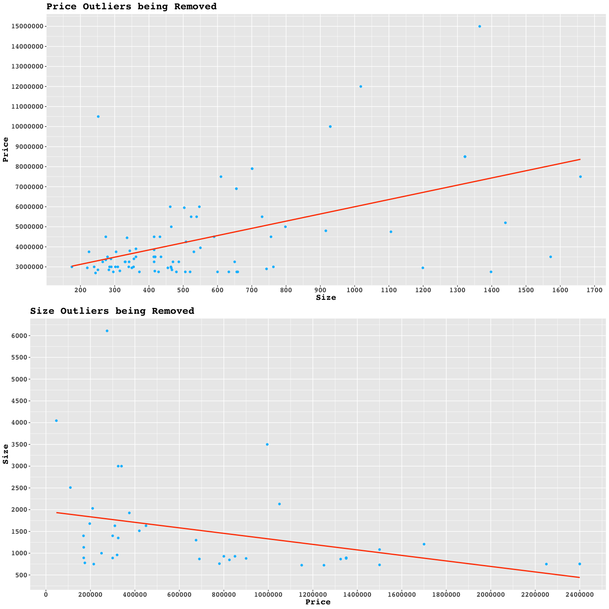

Ireland Housing - Data Exploration
================
Marcos Cavalcante

First step is to install and load the necessary libraries.

``` r
packages <- c("tidyverse", "haven", "devtools", "dplyr", 
              "ggplot2", "gapminder", "patchwork", "ggridges", "PerformanceAnalytics")

if(sum(as.numeric(!packages %in% installed.packages())) != 0){
  installer <- packages[!packages %in% installed.packages()]
  for(i in 1:length(installer)) {
    install.packages(installer, dependencies = T)
    break()
  }
  sapply(packages, require, character = T) 
} else {
  sapply(packages, require, character = T) 
}

devtools::install_github("ropensci/skimr")
library(skimr)
```

## Data Exploration

At this next stage, the output from the cleaning step will be used in to
further explore the variables, to make it explicitly, the dataset
**ireland_houses_cleaned.csv** is going to be used.

For continuous variables, exploration around the lower and upper
boundaries of each variable, their histogram distribution and box-plots
will be created.

With regards to the categorical variables, visualizing their
distribution will be quite important so that the frequency of the
different categories can be seen in the dataset.

Let’s start by using the skim library to have a glimpse of the dataset.

``` r
dataset_directory <- "../../datasets/"
dataset_filename <- paste(dataset_directory, "ireland_houses_cleaned.csv", sep="")

ireland_houses <- read.csv(file = dataset_filename ) # Load the dataset

options(scipen = 999) # turn off scientific notation
skim(ireland_houses)
```

|                                                  |                |
|:-------------------------------------------------|:---------------|
| Name                                             | ireland_houses |
| Number of rows                                   | 78034          |
| Number of columns                                | 12             |
| \_\_\_\_\_\_\_\_\_\_\_\_\_\_\_\_\_\_\_\_\_\_\_   |                |
| Column type frequency:                           |                |
| character                                        | 5              |
| numeric                                          | 7              |
| \_\_\_\_\_\_\_\_\_\_\_\_\_\_\_\_\_\_\_\_\_\_\_\_ |                |
| Group variables                                  | None           |

Data summary

**Variable type: character**

| skim_variable | n_missing | complete_rate | min | max | empty | n_unique | whitespace |
|:--------------|----------:|--------------:|----:|----:|------:|---------:|-----------:|
| address       |         0 |             1 |  18 | 102 |     0 |     8881 |          0 |
| propertyType  |         0 |             1 |   0 |  14 |     6 |        9 |          0 |
| berRating     |         0 |             1 |   0 |   6 |  2316 |       17 |          0 |
| category      |         0 |             1 |   3 |   9 |     0 |        2 |          0 |
| town          |         0 |             1 |   4 |  14 |     0 |       68 |          0 |

**Variable type: numeric**

| skim_variable | n_missing | complete_rate |      mean |        sd |       p0 |       p25 |       p50 |       p75 |          p100 | hist  |
|:--------------|----------:|--------------:|----------:|----------:|---------:|----------:|----------:|----------:|--------------:|:------|
| price         |         0 |          1.00 | 599841.20 | 656064.62 | 40000.00 | 300000.00 | 415000.00 | 650000.00 |   15000000.00 | ▇▁▁▁▁ |
| propertySize  |         0 |          1.00 |    130.07 |    160.86 |     1.00 |     75.00 |    102.00 |    144.00 |       6109.00 | ▇▁▁▁▁ |
| bedrooms      |         0 |          1.00 |      3.19 |      1.43 |     1.00 |      2.00 |      3.00 |      4.00 |         30.00 | ▇▁▁▁▁ |
| bathrooms     |         0 |          1.00 |      2.12 |      1.39 |     1.00 |      1.00 |      2.00 |      3.00 |         28.00 | ▇▁▁▁▁ |
| berEPI        |     35265 |          0.55 |   2692.25 | 483553.68 |     0.34 |    173.71 |    246.86 |    344.67 | 100000000\.00 | ▇▁▁▁▁ |
| latitude      |         0 |          1.00 |     53.19 |      0.50 |    51.44 |     53.29 |     53.33 |     53.36 |         55.38 | ▁▁▇▁▁ |
| longitude     |         0 |          1.00 |     -6.72 |      0.93 |   -10.35 |     -6.43 |     -6.28 |     -6.25 |         -6.01 | ▁▁▁▁▇ |

## Understanding the data

The summary output above already provides great insights into the
dataset. For example:

### Categorical Variables

#### Address

-   There seems to be about 8,881 different addresses, and the total
    number of observations is 78,034.

#### Property Type

-   **Property Type** holds only 9 different values, they are:
    *Apartment*, *Bungalow*, *Detached*, *Duplex*, *End of Terrace*,
    *Semi Detached*, *Terrace*, *Town House* and **NA**.

#### Category

-   It is present in all observations and holds 2 possible values: *Buy*
    and *New Houses*.

#### Town

-   This variable holds the neighborhoods in Ireland, it has 68
    different values. This shows that not all the cities / neighborhoods
    from Ireland are in this dataset - this is expected as there may be
    no houses on sale in those places.

### Continuous Variables

#### Price

-   The mean *price* of houses is around €600,000 and the *most
    expensive* house in the dataset is worth €15 million euro.

-   **Percentiles**: It can be seen on the table that very few, nearly
    0% of the houses have a price of up to €40,000, 25% prices of up to
    €300,000, 50% prices of up to €415,000, 75% prices of up to €650,000
    and no houses are over €15 million euro. Understanding the
    percentiles is quite helpful as it shows how the house prices are
    distributes over the observations.

-   **Standard Deviation**: The standard deviation in the price variable
    is quite high, €656.000, which indicates that there is a great price
    range.

#### Property Size

-   The mean *size* of a house in $sq^2$ is 130 $sq^2$, and the biggest
    house has 6300 $sq^2$.

-   **Percentiles**: In the first percentile it shows that there are
    some observations with under 1$sq^2$; 25% of the houses have up to
    75$sq^2$; 50% of the observations are under 102$sq^2$, 75% are under
    144$sq^2$ and there are no houses bigger than 6109$sq^2$.

-   **Standard Deviation**: The standard deviation in the *property
    size* variable is quite high, 160$sq^2$. What this tells us is that
    there is a large range of house sizes, as a comparison, the standard
    deviation is greater than 75% of the observations.

#### Bathrooms

-   The **bathrooms** variable shows some interesting behaviour, where
    the mean is about 2 bathrooms per house and the maximum number of
    bathrooms in a house is 28.

#### Bedrooms

-   Similar to the *bathrooms* variable, **bedrooms** also show an
    intersting behaviour, the mean is 3 bedrooms per house and the
    maximum number of bedrooms is 30.

## Frequency graphs

Let’s start the data exploration by plotting frequency graphs in order
to understand how the observations are distributed over different
variables, for example: *property type*, *property size* and *house
price*.

### Property Type Bar Chart

The bar chart below shows the observations are distributed over the
property types. It is clear that the majority of the houses are terrace
and are followed by semi-detached, detached and apartments respectively.

The graph also shows that some houses have no value for property type
and therefore have missing data.

``` r
ggplot(data = ireland_houses) +
  geom_bar(
    width = 0.4,
    mapping = aes(fill = as.factor(propertyType), 
                  x = factor(propertyType,
                      labels = c("NA", 
                                 "Apartment", 
                                 "Bungalow", 
                                 "Detached", 
                                 "Duplex", 
                                 "End of Terrace", 
                                 "Semi-Detached", 
                                 "Terrace", 
                                 "Town House"
  )))) +
  scale_y_continuous(breaks = seq(0, 27000, 2000)) +
  labs(title = "Property Types Count", 
       x = "Property Type",
       y = "Count") +
  coord_flip() +
  theme(legend.position="none")
```

<!-- -->

### Property Type by Proper

``` r
chart.Correlation((ireland_houses[2:4]), histogram = TRUE)
```

<!-- -->

### Property Type by Price Bivariate graph

After understanding how the observations are distributed across the 16
valid property types. It can clearly be seen that *Terrace*,
*Semi-Detached* and *Detached* houses roughly represent over 75% of the
houses.

The next graph displays how prices and property prices are related.

``` r
# propertyTypeFactor = factor(propertyType,labels = c(
#                                  "NA", 
#                                  "Apartment", 
#                                  "Bungalow", 
#                                  "Detached", 
#                                  "Duplex", 
#                                  "End of Terrace", 
#                                  "Semi-Detached", 
#                                  "Terrace", 
#                                  "Town House"))


ggplot(data = ireland_houses) + 
  geom_density_ridges(aes(x = price, 
                          y = propertyType, 
                          fill = propertyType)) +
  scale_x_continuous(name = "price", limits = c(0, 1000000)) +
  theme_ridges() + 
  labs(title = "Property Type by Price", x = "Price", y = "Property Type") +
  theme(legend.position = "none")
```

    ## Picking joint bandwidth of 38100

    ## Warning: Removed 8210 rows containing non-finite values (stat_density_ridges).

<!-- -->

### House Price

In order to better visualize how the observations distribute across the
price range, let’s choose the range from €0 to €2 million euro as it
will allow us to well visualise where most of the observations fall.

``` r
ggplot(ireland_houses, aes(x = price, colour = propertyType, fill = propertyType)) +
  geom_freqpoly(
    bins=30,
    lwd = 1,
    linetype = 2
  ) +
  labs(
    title = "Frequency of House Prices in Ireland",
    x = "Price",
    y = "Observations",
    color = "Property Type"
  ) +
  xlim(0, 2000000) +
  scale_fill_brewer() 
```

<!-- -->

### Property Type

For this graph, for visualization sake, let’s pick the house which have
property size smaller than 750 $sq^2$

``` r
ggplot(ireland_houses, aes(x = propertySize, colour = propertyType, fill = propertyType)) +
  geom_freqpoly(
    bins=30,
    lwd = 1,
    linetype = 2
  ) +
  labs(
    title = "Frequency of Property Size in Ireland",
    x = "Property size in square meters",
    y = "Observations",
    color = "Property Type"
  ) +
  xlim(0, 500) +
  scale_fill_brewer() 
```

<!-- -->
