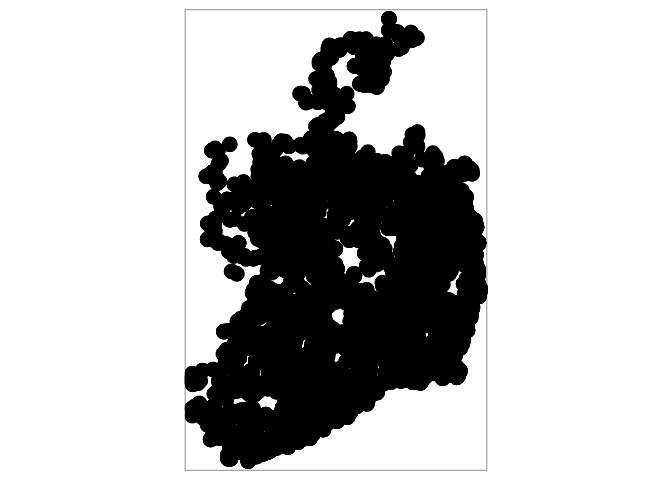
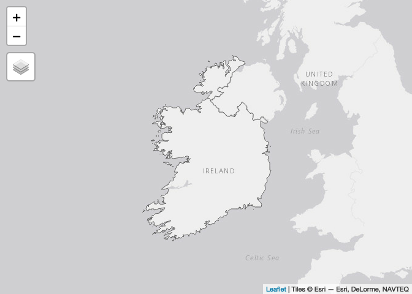
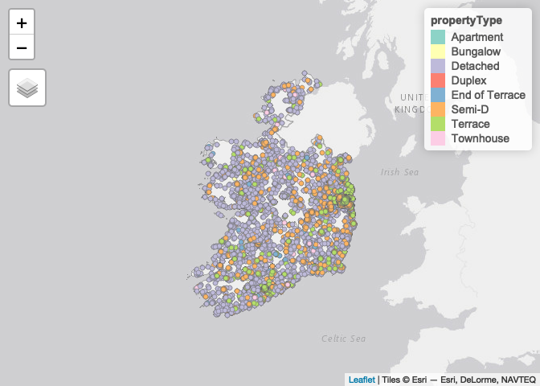

Ireland Housing - Spatial Analysis
================
Marcos Cavalcante

First step is to install and load the necessary libraries.

``` r
packages <- c("tidyverse","sf","tmap","rgdal","rgeos","adehabitatHR","knitr",
             "kableExtra")

if(sum(as.numeric(!packages %in% installed.packages())) != 0){
  installer <- packages[!packages %in% installed.packages()]
  for(i in 1:length(installer)) {
    install.packages(installer, dependencies = T)
    break()
  }
  sapply(packages, require, character = T) 
} else {
  sapply(packages, require, character = T) 
}

webshot::install_phantomjs()
```

## Load the data and convert to Simple Feature object

``` r
dataset_directory <- "../../datasets/"
dataset_filename <- paste(dataset_directory, "ireland_houses_filtered.csv", sep="")

ireland_houses <- read.csv(file = dataset_filename ) # Load the dataset


# Lets create an sf object from our dataset
ireland_houses_sf <- st_as_sf(x = ireland_houses, 
                         coords = c("longitude", "latitude"), 
                         crs = 4326)
```

## Plotting the data spatially

``` r
tmap_mode("view")
```

    ## tmap mode set to interactive viewing

``` r
tm_shape(shp = ireland_houses_sf) + 
  tm_dots(col = "deepskyblue4", 
          border.col = "black", 
          size = 0.02, 
          alpha = 0.8)
```

<!-- -->

## Loading shapefile with the map of Ireland

``` r
shp_ireland <- readOGR("../../datasets/shapefile_ireland", "gadm41_IRL_0")
```

    ## Warning: OGR support is provided by the sf and terra packages among others

    ## Warning: OGR support is provided by the sf and terra packages among others

    ## Warning: OGR support is provided by the sf and terra packages among others

    ## Warning: OGR support is provided by the sf and terra packages among others

    ## Warning: OGR support is provided by the sf and terra packages among others

    ## Warning: OGR support is provided by the sf and terra packages among others

    ## OGR data source with driver: ESRI Shapefile 
    ## Source: "/Users/marcoscavalcante/Projects/housing-dataset-geospatial-analysis/datasets/shapefile_ireland", layer: "gadm41_IRL_0"
    ## with 1 features
    ## It has 2 fields

``` r
tm_shape(shp = shp_ireland) + 
  tm_borders()
```

<!-- -->

## Joining the two objects together

``` r
tm_shape(shp = shp_ireland) + 
  tm_borders(alpha = 0.5) +
  tm_shape(shp = ireland_houses_sf) + 
  tm_dots(col = "propertyType", 
          size = 0.02)
```

<!-- -->
